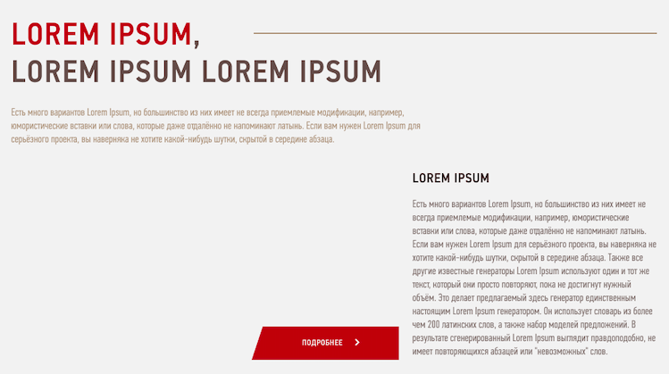

# Тестовое задание от Creative Mind bureau

---

---

### Директории проекта

- `src/images` — директория со статичными изображениями
- `src/blocks` — директория с блоками стилей
- `src/vendor` — директория с шрифтами и глобальными стилями
- `src/pages` — директория с корневыми файлами страниц
- `src/scripts` — директория с скриптами
- `config/build` — директория со сборкой конфига для webpack

---

### Работа выполнена с использованием технологий:

- HTML 
- CSS 
- JavaScript 
- Flexbox Layout
- Grid Layout

---

### Команды для работы с проектом

- `npm start` — запуск проекта
- `npm run build:dev` — сборка проекта в дев режиме
- `npm run build:prod` — сборка проекта в прод режиме
- `npm run lint:js` — запуск проверки линтнера js
- `npm run lint:js:fix` — исправление ошибок линтнера js
- `npm run stylelint:css` — запуск проверки линтнера css
- `npm run stylelint:css` — исправление ошибок линтнера css

---

### Описание ТЗ

---

### Над проектом работал:
<h3><a href="https://github.com/atvk" target="_blank">Стебловский Антон</a></h3>

---

### Ссылки на проект

https://github.com/atvk/lorem_Ipsum

https://lorem-ipsum-rho.vercel.app/

